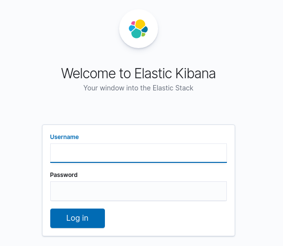
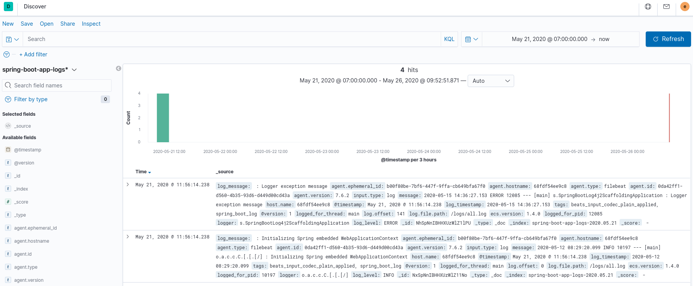
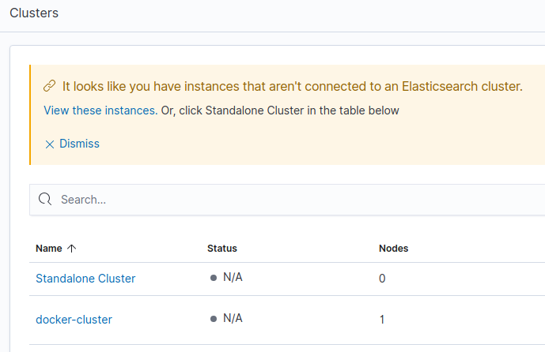
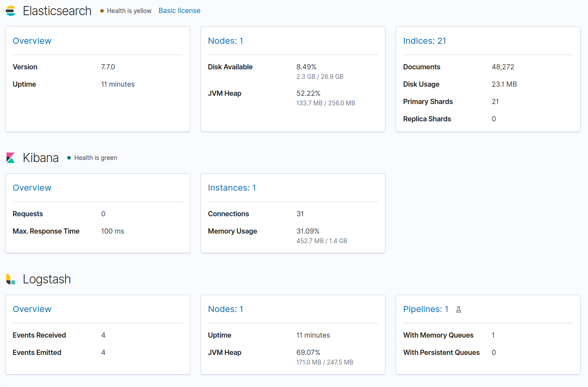

# spring-boot-log4j-2-scaffolding


This project is a simple scaffolding for a Spring Boot application that uses Log4j 2 for logging and Elastic Stack for processing log entries.

To learn how to set up a project like this one, check out the following posts:

* [Spring Boot Log4j 2 advanced configuration #1 - saving logs to files](https://keepgrowing.in/java/springboot/spring-boot-log4j-2-advanced-configuration-1-saving-logs-to-files/)
* [Spring Boot Log4j 2 advanced configuration #2 - add a Rollover Strategy for log files](https://keepgrowing.in/java/springboot/spring-boot-log4j-2-advanced-configuration-2-add-a-rollover-strategy-for-log-files/)
* [Processing logs with Elastic Stack #1 - parse and send various log entries to ElasticSearch](https://keepgrowing.in/java/springboot/processing-logs-with-elastic-stack-1-parse-and-send-various-log-entries-to-elasticsearch/)
* [Processing logs with Elastic Stack #2 - configure Kibana](https://keepgrowing.in/java/springboot/processing-logs-with-elastic-stack-2-configure-kibana/)
* [Monitoring Elastic Stack](https://keepgrowing.in/tools/monitoring-elastic-stack/)
* [How to make one Docker container wait for another](https://keepgrowing.in/tools/how-to-make-one-docker-container-wait-for-another/)

## Getting Started

To clone the repository, run in the command line:
```bash
$ git clone https://github.com/little-pinecone/spring-boot-log4j-2-scaffolding.git
```

You can build the application with:
```bash
$ mvn clean install
```

### Run Elastic Stack

* Run this application to make sure that the `all.log` file is created and not empty (more than one line is required).
* Run the `$ docker-compose up -d` command in the project directory. The following services should be started:
```
IMAGE                                     PORTS                                            NAMES
elasticsearch:7.7.0                  0.0.0.0:9200->9200/tcp, 9300/tcp                 springbootelasticstack_elasticsearch_1
logstash:7.7.0                       0.0.0.0:5044->5044/tcp, 0.0.0.0:9600->9600/tcp   springbootelasticstack_logstash_1
kibana:7.7.0                         0.0.0.0:5601->5601/tcp                           springbootelasticstack_kibana_1
springbootelasticstack_filebeat                                                       springbootelasticstack_filebeat_1
springbootelasticstack_metricbeat                                                     springbootelasticstack_metricbeat_1
elastichq/elasticsearch-hq:latest    0.0.0.0:5000->5000/tcp                           springbootelasticstack_elastichq_1
```
* Visit `http://localhost:5000/#!/` to use ElastiHQ interface to verify the content send to Elasticsearch (run `Query` for the `spring-boot-app-logs-YYYY.MM.dd` index):
 

 
* Visit `http://localhost:5601/` to log in to Kibana:



* Use the default username:`elastic` and password: `test`.
* Create `index` defined in the `logstash.conf` file and browse logs accumulated in the `logs/all.log` file (the file is automatically created on the application startup):



* Visit `http://localhost:5601/app/monitoring` to check out clusters monitoring:



`Standalone cluster` shows metrics for Filebeat, `docker-cluster` displays metrics for Elasticsearch, Kibana and Logstash:



## Overview and technical features

* [Log4j 2](https://logging.apache.org/log4j/2.x/) is used for logs processing.
* The application uses the `root` logger and sends log entries to `RollingFile` and `Console` appenders (when you run the app, the `logs` directory will be created automatically).
* After log entries had been processed by Filebeat and Logstash, they are send to ElasticSearch.
* You can browse logs in Kibana.
* You can browse Elastic Stack metrics in a Kibana dashboard


## Built With

* [Java 11](https://openjdk.java.net/projects/jdk/11/)
* [Spring Boot 2.2.6](https://start.spring.io/)
* [Docker Compose](https://docs.docker.com/compose/)
* [Elastic Stack](https://www.elastic.co/what-is/elk-stack)
* [Metricbeat](https://www.elastic.co/guide/en/beats/metricbeat/current/index.html)
* [Maven](https://maven.apache.org/)

## License

This project is licensed under the MIT License - see the [license details](https://opensource.org/licenses/MIT).